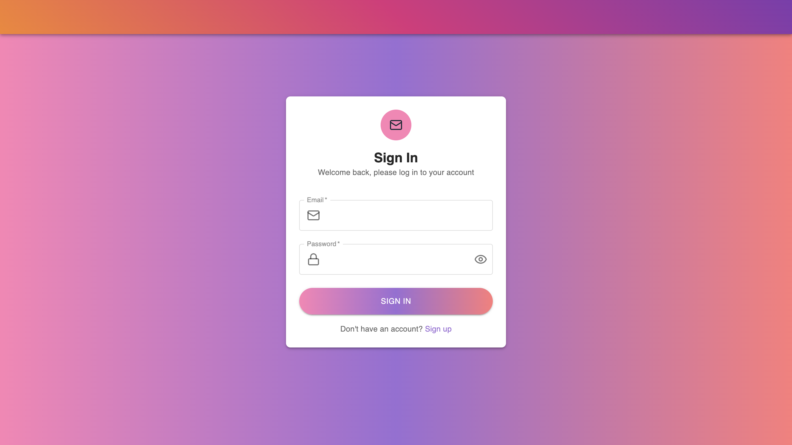
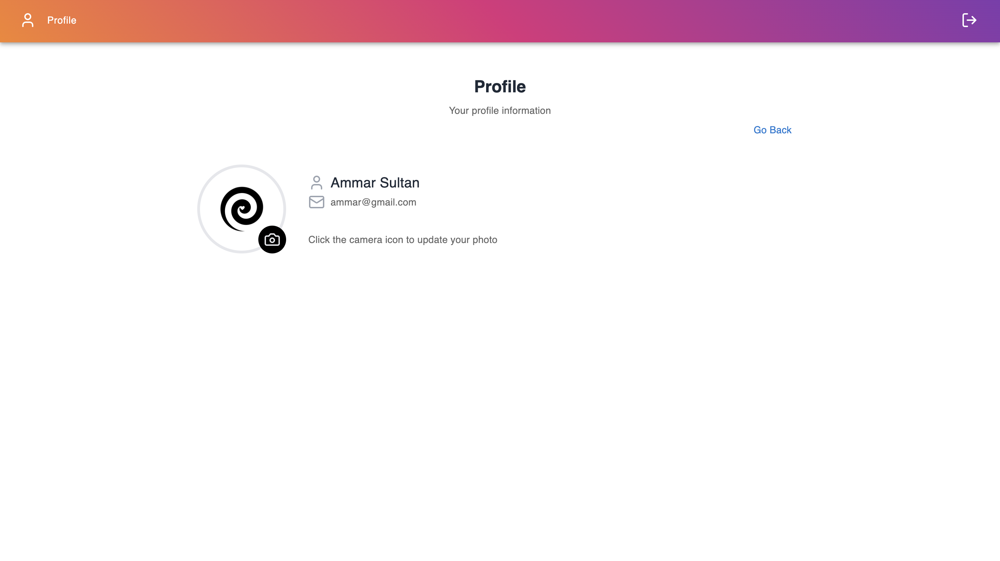
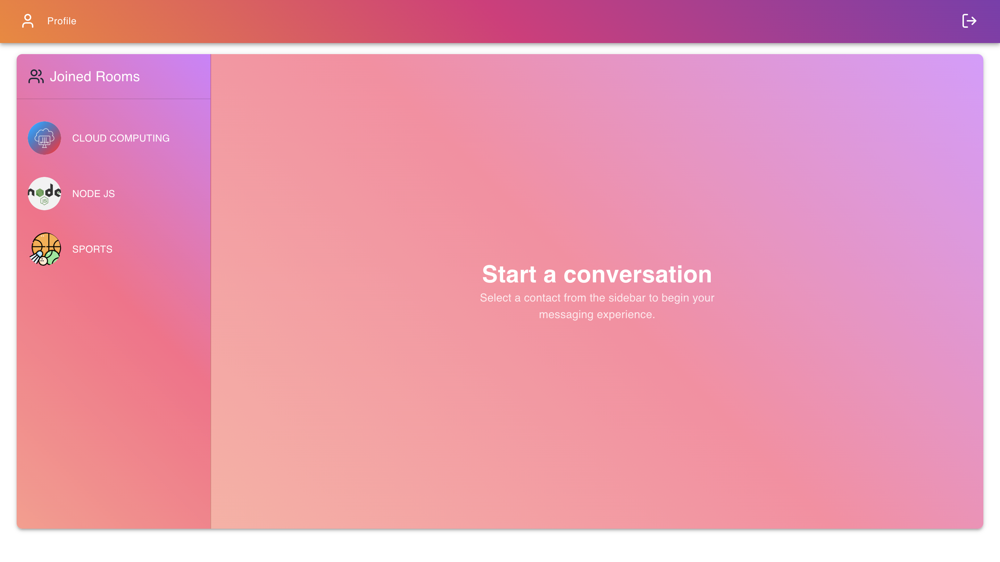
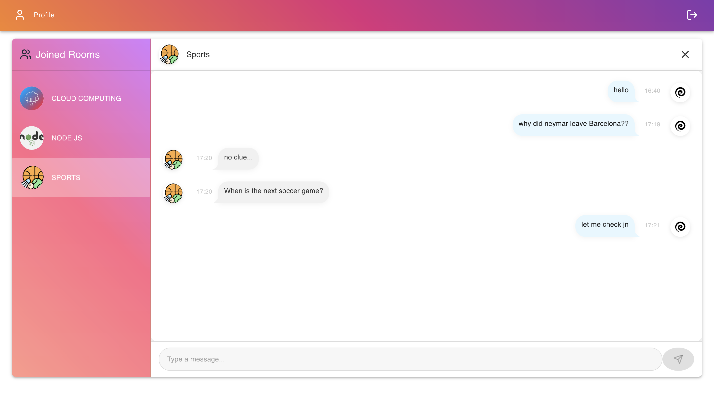

# Real-Time Chat Application

## Overview

This is a real-time chat application. The app allows users to sign up, log in, join predefined chat rooms, send and receive messages, and see typing indicators. Messages are persisted in MongoDB, and Socket.io is used for real-time communication.

## Tech Stack

### Backend

- **Node.js** with **Express.js**
- **Socket.io** for real-time communication
- **MongoDB** with **Mongoose** for data persistence

### Frontend

- **React.js** for building the user interface
- **MUI (Material UI)** for UI components such as `Avatar`, `Typography`, `Button`, `Input`, and `IconButton`
- **Lucide Icons** for vector icons like `X` (close chat) and `Send` (send message)
- **Tailwind CSS** for styling the layout and components
- **Zustand** for state management (used in `useChatStore` for managing chat state, user selection, and message sending)

## Features

- ✔️ User Signup & Login (with session management via localStorage)
- ✔️ Room-based messaging (users can only chat within joined rooms)
- ✔️ Real-time chat using **Socket.io**
- ✔️ Typing indicator for private messages
- ✔️ Message storage in **MongoDB**
- ✔️ Logout functionality

## Screenshots

### Signup Page

### Signin Page

### User Profile Page

### Home Page

### Joined Room Conversation Page

